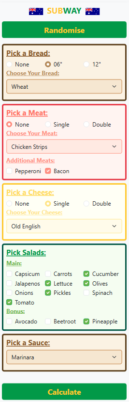

# Subway AU Macro Calculator

Subway AU Macro Calculator is a JavaScript-based tool that allows users to calculate the nutritional values of their Subway sandwich based on selected ingredients. This project utilizes HTML, JavaScript, and Bootstrap to provide an interactive user experience. Users can select bread type, meat, cheese, salads, sauces, and extras to compute the total macronutrients (calories, protein, fat, carbohydrates) of their custom Subway sandwich.

  

## Getting Started

These instructions will guide you through getting a copy of the project up and running on your local machine for development and testing purposes.

Purely so if anyone wanted to try it out, they can do so here: https://kkdn7355.github.io/Calculator-Subway-Sandwich-Macros/

### Prerequisites

- **Web Browser**: A modern web browser (Google Chrome, Mozilla Firefox, etc.) is required to use the calculator.

No installation of additional software is needed.

## Using the Calculator

1. Select your preferred sandwich ingredients including bread type, meat, cheese, salads, and sauces.
2. Click the **Calculate** button to display the total macronutrients.
3. The results will be shown in a formatted display with values for Calories, Protein, Fat, and Carbohydrates.

### Features

- **Ingredient Selection**: Choose from various breads, meats, cheeses, salads, and sauces.
- **Real-time Macro Calculation**: Compute the total macronutrients instantly based on selected options.
- **User-friendly Interface**: Designed with Bootstrap for a smooth and interactive experience.
- **Error Handling**: Alerts users if any required selections are missing or incorrect.

## Built With

* **HTML5** - For structuring the web interface
* **CSS & Bootstrap** - For styling and responsive design
* **JavaScript** - For handling calculations and user interactions

## License

This project is licensed under the MIT License - see the [LICENSE.md](LICENSE.md) file for details.

## Acknowledgments

* Inspired by the need for a customizable Subway nutrition calculator (because their app actually has discounts around this period).
* Special thanks to contributors for suggestions and feedback.
