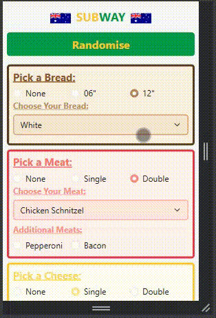

# Subway AU Macro Calculator (in HTML5 and JS)

## Description

Subway AU Macro Calculator is a JavaScript-based tool that allows users to calculate the nutritional values of their Subway sandwich based on selected ingredients. This project utilizes HTML, JavaScript, and Bootstrap to provide an interactive user experience. Users can select bread type, meat, cheese, salads, sauces, and extras to compute the total macronutrients (calories, protein, fat, carbohydrates) of their custom Subway sandwich.

Purely so if anyone wanted to try it out, they can do so here: https://kkdn7355.github.io/Calculator-Subway-Sandwich-Macros/

## Demo

<p align="center">
  
</p>

<p align="center">
  
</p>

## Getting Started

### Dependencies:

- **Web Browser**: A modern web browser (Google Chrome, Mozilla Firefox, etc.) is required to play the game.

### Executing Program:

1. Clone the repository:
   ```bash
   git clone https://github.com/your-username/Calculator-Subway-Sandwich-Macros.git
   cd Calculator-Subway-Sandwich-Macros
   ```

2. Open `index.html` in your browser:
   ```bash
   open index.html   # For macOS
   start index.html  # For Windows
   ```

## Features

- **Ingredient Selection**: Choose from various breads, meats, cheeses, salads, and sauces.
- **Real-time Macro Calculation**: Compute the total macronutrients instantly based on selected options.
- **User-friendly Interface**: Designed with Bootstrap for a smooth and interactive experience.
- **Error Handling**: Alerts users if any required selections are missing or incorrect.

## Roadmap

N/A

## License

This project is licensed under the MIT License - see the [LICENSE.md](LICENSE.md) file for details.

## Acknowledgments

* Inspiration from the American Subway macronutrient calculator.
* Thanks to online resources for tutorials and guides.
* Special thanks to contributors for suggestions and feedback.
